## 一、背景
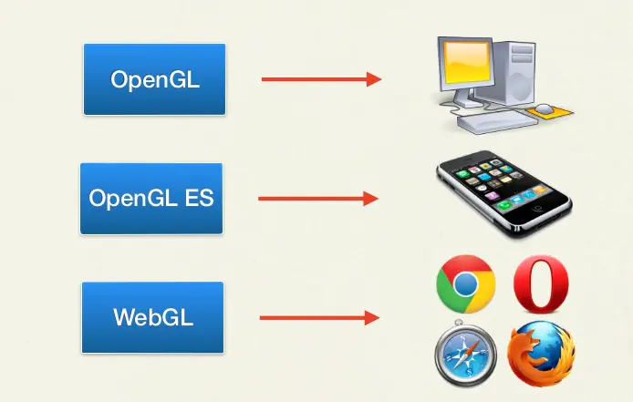
1. OpenGL 是用于渲染 2D、3D 图形的跨语言、跨平台的应用程序编程接口（API）。这个接口由近 350 个不同的函数调用组成。
2. OpenGL ES 是 OpenGL 三维图形API的子集，针对手机、PDA和游戏主机等嵌入式设备而设计。基于OpenGL，一般使用 C 或 Cpp 开发，对前端开发者来说不是很友好。
3. WebGL 把 JavaScript 和 OpenGL ES 2.0 结合在一起，从而为前端开发者提供了使用 JavaScript 编写 3D 效果的能力。

## 二、THREE.JS基础
Three.js是基于原生 WebGL 封装运行的三维引擎，在所有 WebGL 引擎中，Three.js 是国内资料最多、使用最广泛的。
### 1、坐标系
```
右手坐标系
```
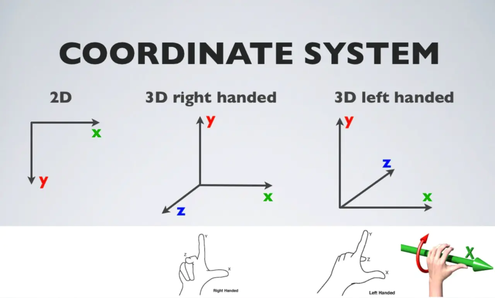
### 2、场景
```
是一个容器，主要用于保存、跟踪所要渲染的物体和使用的光源。
```
### 3、摄像机
```
决定了能够在场景中看到什么。
```
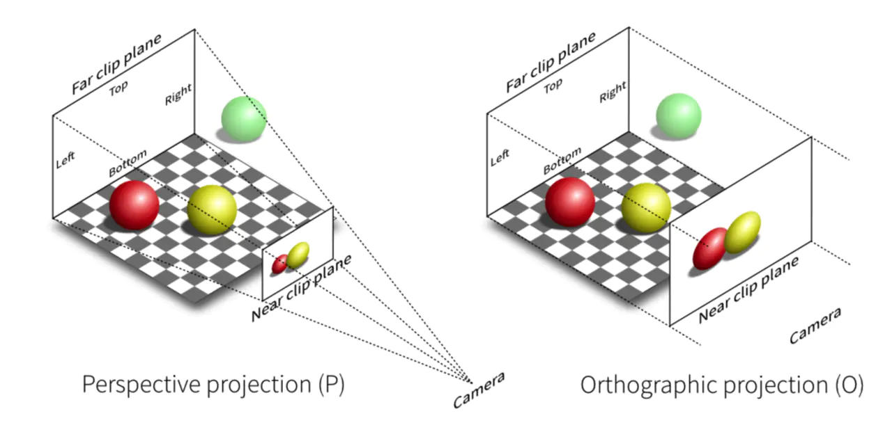
- 右侧是 OrthographicCamera（正交投影相机），他不具有透视效果，即物体的大小不受远近距离的影响，对应的是投影中的正交投影。
- 左侧是PerspectiveCamera（透视相机），这符合我们正常人的视野，近大远小，对应的是投影中的透视投影。
### 4、渲染器
- CanvasRenderer 使用 Canvas 2D Context API 兼容性更高
- DOMRenderer
- SVGRenderer
- WebGLRenderer 使用WebGL将能够利用GPU硬件加速从而提高渲染性能
  
> WebGLRenderer 与 CanvasRenderer 对比
  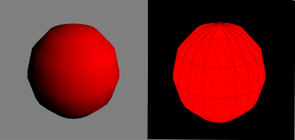

## 三、THREE.JS核心API
### 1、几何体
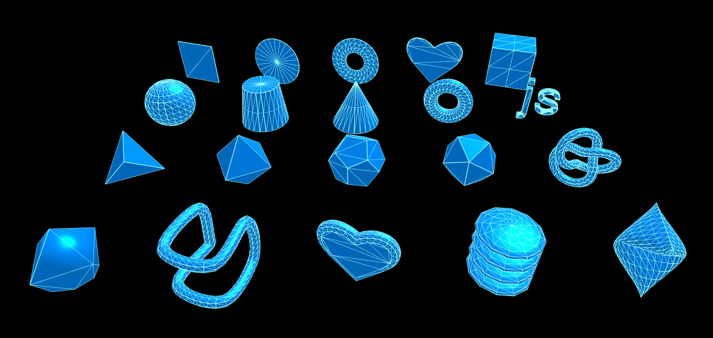

- 基类几何体 - BufferGeometry
  - 二维几何体
    - 平面几何体 - PlaneGeometry
    - 圆形几何体 - CircleGeometry
    - 圆环几何体 - RingGeometry
  - 三维几何体
    - 立方几何体 - BoxGeometry
    - 球形集合体 - SphereGeometry
    - 圆锥几何体 - ConeGeometry
    - 圆柱几何体 - CylinderGeometry
    - 圆环几何体 - TorusGeometry
  

- 立方几何体 - BoxGeometry

  属性 |	是否必填	 | 描述
  --- | --- |  ---
  width |	是 |	宽度，沿X轴方向的长度
  height |	是 |	高度，沿Y轴方向的长度
  depth	 | 是	 | 深度，沿Z轴方向的长度
  widthSegment |	否 |	沿X轴方向将面分成多少份，默认1
  heightSegment |	否 |	沿Y轴方向将面分成多少份，默认1
  depthSegment |	否 |	沿Z轴方向将面分成多少份，默认1

- 球形几何体 - SphereGeometry

  属性 |	是否必填	 | 描述
  --- | --- |  ---
  radius	| 否 |	设置球体半径，默认50
  widthSegment	| 否 |	指定竖直方向的分段数，段数越多球体越光滑。默认为8，最小为3。
  heightSegment |	否 |	指定水平方向的分段数，段数越多球体越光滑。默认为6，最小为2。
  phiStart |	否 |	指定从X轴什么方向开始绘制球体，范围 0 - 2 * PI。默认 0。
  phiLength |	否 |	指定从 phiStart 开始画多少。 2 * PI 是整球。默认 2 * PI。
  thetaStart |	否 | 指定从Y轴什么方向开始绘制球体，范围 0 - PI。默认 0。
  thetaLength |	否 |	指定从 thetaStar 开始画多少。 PI 是整球。默认 PI。

- 不同分段数量下的立体展示（分段越多，弧线越圆滑，内存消耗也越大）
  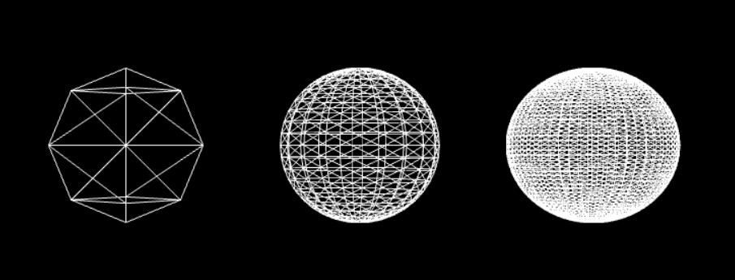

### 2、材质

- 基础网格材质 - MeshBasicMaterial
  ```
  一个以简单着色方式来绘制几何体的材质，不受光照的影响
  ```
  > 演示：http://localhost:3000/chapter-04/01-basic-mesh-material.html

  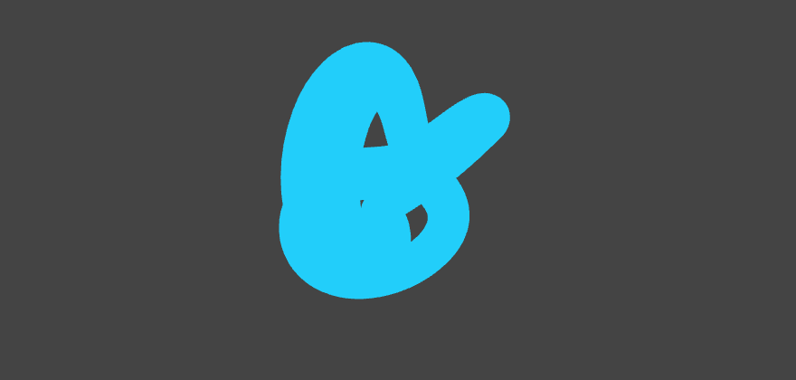


- 深度着色材质 - MeshDepthMaterial
  ```
  外观特性是由物体到相机的距离决定，可以和其他材质结合创造出逐渐消失的效果
  ```
  > 演示：http://localhost:3000/chapter-04/02-depth-material.html

  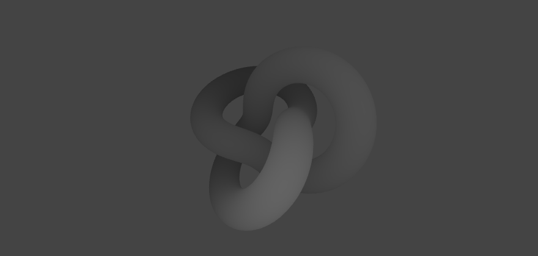


- Lambert网格材质 - MeshLambertMaterial
  ```
  对光进行漫反射，用于创建暗淡的不发光物体
  ```
  > 演示：http://localhost:3000/chapter-04/06-mesh-lambert-material.html

  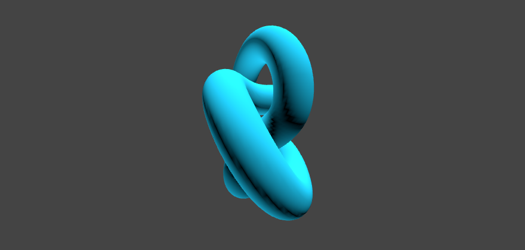


- Phong网格材质 - MeshPhongMaterial
  ```
  对光有反应，用于创建金属类有光泽的物体
  ```
  - 演示：http://localhost:3000/chapter-04/07-mesh-phong-material.html

  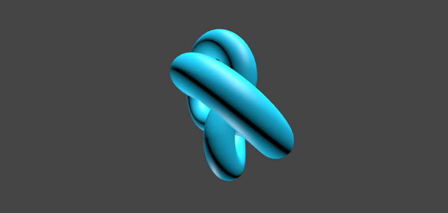


- 着色器材质 - ShaderMaterial
  ```
  允许使用自定义的着色器
  ```
  - 演示：http://localhost:3000/chapter-04/08-shader-material.html

  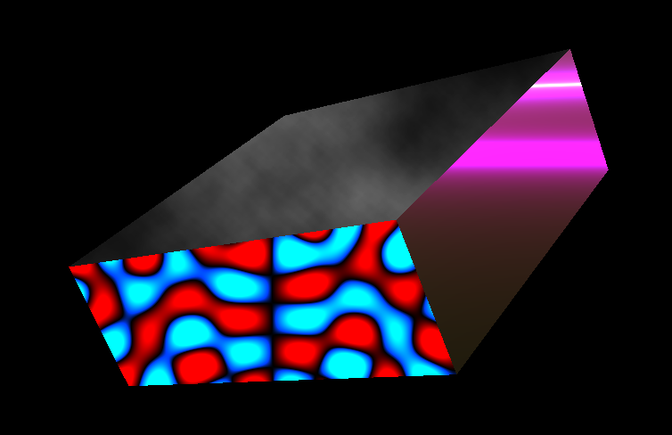

### 3、光源

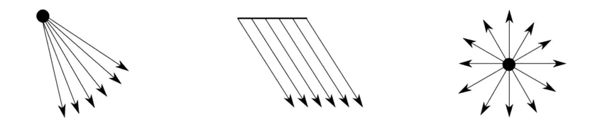

- 环境光 - AmbientLight
  ```
    - 会均匀的照亮场景中的所有物体，颜色会应用到全局
    - 该光源并没有特别的来源方向，并且不会产生阴影。
  ```
  > 演示：http://localhost:3000/chapter-03/01-ambient-light.html

- 平行光 - DirectionalLight
  ```
  平行光是沿着特定方向发射的光，这种光的表现像是无限远，从它发出的光线都是平行的
  ```
  > 演示：http://localhost:3000/chapter-03/04-directional-light.html

- 聚光灯 - SpotLight
  ```
  光线从一个点沿一个方向射出，随着光线照射的变远，光线圆锥体的尺寸也逐渐增大
  ```
  > 演示：http://localhost:3000/chapter-03/03-spot-light.html

- 点光源 - PointLight
  ```
  从一个点向各个方向发射的光源，一个常见的例子是模拟一个灯泡发出的光
  ```
  > 演示：http://localhost:3000/chapter-03/02-point-light.html

- 半球光 - HemisphereLight
  ```
  这是一个特殊的光源，可以通过模拟反光面，和光线微弱的天空，来创建出更加自然的室外光，该光源不提供阴影效果。
  ```
  > 演示：http://localhost:3000/chapter-03/05-hemisphere-light.html

### 4、动画
- HTML5 API - requestAnimateFrame()
  - 优势（对比 setTimeout、setInterval ）
    - 1)、requestAnimationFrame 会把每一帧中的所有DOM操作集中起来，在一次重绘或回流中就完成，并且重绘或回流的时间间隔紧紧跟随浏览器的刷新频率，一般来说，这个频率为每秒60帧。
    - 2)、在隐藏或不可见的元素中，requestAnimationFrame将不会进行重绘或回流，这当然就意味着更少的的cpu，gpu和内存使用量。
- Tween.js
### 5、控制器
- 拖放控制器 - DragControls
```
该类被用于提供一个拖放交互
```
- 轨道控制器 - OrbitControls
```
可以使得相机围绕目标进行轨道运动
```
- 轨迹球控制器 - TrackballControls
```
可以在3D空间中任意变换摄像机（鼠标控制）
```
- 飞行控制器 - FlyControls
```
可以在3D空间中任意变换摄像机，并且无任何限制（键盘控制）
```
- 第一人称控制器 - FirstPersonControls
```
该类是 FlyControls 的另一个实现
```
### 6、粒子和精灵
> 体验
  - http://localhost:3000/chapter-07/05a-program-based-point-cloud-webgl.html
### 7、物理效果
- PointConstraint - 点对点约束
  - 通过这个约束，你可以将一个对象与另一个对象之间的位置固定下来。例如一个对象动了，另一个对象也会随着移动，它们之间的距离和方向保持不变
- HingeConstraint - 铰链约束
  - 通过这个约束，你可以限制一个对象只能像铰链一样移动，例如门
- ConeTwistConstraint - 锥形约束
  - 通过这个约束，你可以用一个对象限制另一个对象的旋转和移动。这个约束的功能类似于一个球削式关节。例如，胳膊在肩关节中的活动
> 体验
  - http://localhost:3000/chapter-12/01-basic-scene.html

## 四、THREE.JS API梳理
### 1、继承关系
  - xxxCamera => Camera => Object3D - 相机
  - Scene => Object3D - 场景
  - Mesh => Object3D - 网格
  - xxxGeometry => BufferGeometry 几何体
  - xxxMaterial => Meterial 材质
> 
### 2、Object3D
  > 属性
  - castShadow 对象是否被渲染到阴影贴图中
  - receiveShadow 材质是否接收阴影
  - position 表示对象局部位置的三维向量
  - layers 物体的层级关系
  - visible 可见性
  - parent 一个对象的父级对象
  - children 含有对象的子级的数组
  > 方法
  - add() 添加对象到这个对象的子级 
  - remove() 从当前对象的子级中移除对象
  - scale() 缩放
  - translate() 平移
  - rotate() 绕轴旋转
  
## 五、案例欣赏
- 人物
https://threejs.org/examples/#webgl_animation_skinning_blending
- 房子
https://threejs.org/examples/#webgl_animation_keyframes
- 镜面
https://threejs.org/examples/#webgl_materials_cubemap_dynamic
- 粒子
https://threejs.org/examples/#webgl_buffergeometry_lines

## 六、分享过程
- 效果演示
  - 控制模式
    - 轨迹球控制器
    - 飞行控制器
  - 视觉
    - 鱼眼 cameraOptions.fov = 90
    - 空间轨道 orbitalMode = 2
    - 无轨运行 showTrack = false
    - 没有星星 showSprite = false
- 文档分享
  - 理论知识
- 代码分享
  - 实战应用
## 七、应用知识点
  - 场景 + 透视相机 + WebGL渲染器
  - 星球 - 几何体+纹理+动画+投影+产生阴影+组合
  - 太阳 - 几何体+纹理+动画+点光源
  - 飞船 - 飞行控制器
  - 繁星 - 粒子